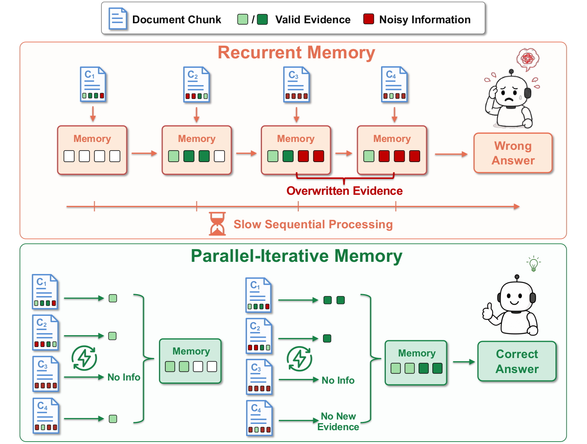
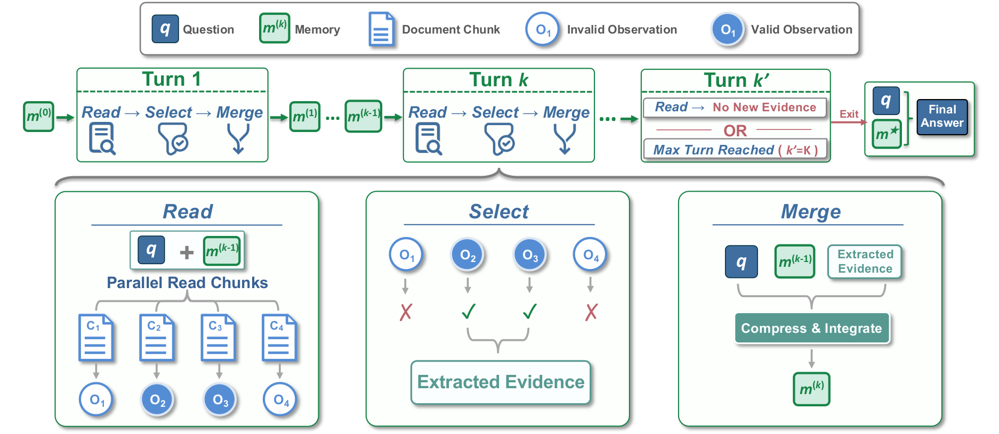

<div align="center">

# PI-Mem: Pushing Long-Context Reasoning to 3.6M Tokens with Parallel-Iterative Memory

<p>
  <a href="https://huggingface.co/collections/JetLM/pi-mem"></a>
  <a href="https://huggingface.co/datasets/JetLM/PI-Mem-Data"></a>
  <a href="https://github.com/JetAstra/PI-Mem"></a>
  <a href="https://arxiv.org/abs/2608.03048"></a>
</p>

</div>

---

<p align="center">
  
</p>

<p align="center"><em>
Recurrent memory processes chunks sequentially and may overwrite early evidence with later noise. PI-Mem reads chunks in parallel conditioned on a shared global memory, improving evidence preservation and reducing inference latency.
</em></p>

## Overview

**PI-Mem (Parallel-Iterative Memory)** replaces sequential updates with a bounded **read–select–merge** workflow. In each turn, it reads all chunks in parallel against a shared memory, selects new or complementary evidence, and merges it into a compact state for the next turn. The workflow exits when no new evidence is found or the maximum number of turns is reached.

<p align="center">
  
</p>

<p align="center"><em>
Each PI-Mem turn performs parallel reading, evidence selection, and compact memory merging. Final answering uses the question and the consolidated global memory rather than the original ultra-long context.
</em></p>

## Installation

PI-Mem is built on the [`main` branch of verl](https://github.com/verl-project/verl/tree/main), using [commit `e1ff774`](https://github.com/verl-project/verl/commit/e1ff774f74565b44a567d02014454543e7361628) as its upstream base. Because the software stack includes several CUDA-compiled components, a portable one-command installation cannot reliably cover every GPU and system configuration. We recommend reproducing the tested stack below and using [`docker/Dockerfile.stable.vllm`](./docker/Dockerfile.stable.vllm) as the ordered build reference.

### Reference environment

| Component                          | Tested version                       |
| ---------------------------------- | ------------------------------------ |
| Operating system                   | Ubuntu 24.04                         |
| Python                             | 3.12                                 |
| CUDA                               | >= 12.8                              |                          |
| PyTorch / TorchVision / TorchAudio | 2.10.0 / 0.25.0 / 2.10.0 (CUDA 12.x) |
| vLLM                               | 0.18.0                               |
| Transformers                       | 5.3.0                                |
| FlashAttention                     | 2.8.3                                |
| Ray                                | 2.55.1                               |
| Megatron Core                      | 0.16.0                               |
| Transformer Engine                 | 2.12                                 |

### Setup guidance

1. Start from a CUDA 12.8 or newer development environment with Python 3.12 and install the matching PyTorch packages.
2. Install CUDA extensions—such as Apex, Transformer Engine, and FlashAttention—against the same CUDA and PyTorch ABI, following the order in the reference Dockerfile.
3. Install vLLM, Transformers, Ray, and the remaining Python dependencies using the versions recorded in [`requirements.txt`](./requirements.txt).
4. Install this repository in editable mode after its dependencies are available:

```bash
git clone https://github.com/JetAstra/PI-Mem.git
cd PI-Mem
pip install -e . --no-deps
```

> [!IMPORTANT]
> `requirements.txt` is an exact snapshot of our development environment, not a directly portable lockfile. Some entries point to machine-local wheels or source trees through `file://` paths and must be replaced with builds appropriate for the target system. Megatron Core, Transformer Engine, and Apex are needed only for the corresponding training backends; evaluation with the provided vLLM launchers does not require the full training stack.

## Evaluation

### Step 1: Prepare the evaluation data

RULER HQA and OOD data are released in [`hotpotqa_eval/`](https://huggingface.co/datasets/JetLM/PI-Mem-Data/tree/main/hotpotqa_eval). Choose either remote or local loading:

- **Remote loading:** no preparation is required. The RULER launchers default to `hf://datasets/JetLM/PI-Mem-Data/hotpotqa_eval`.
- **Local loading:** download the directory without flattening it, then point `DATA_ROOT` to it:

```bash
mkdir -p data/PI-Mem-Data
hf download JetLM/PI-Mem-Data \
  --repo-type dataset \
  --include "hotpotqa_eval/*" \
  --local-dir data/PI-Mem-Data

export DATA_ROOT="$PWD/data/PI-Mem-Data/hotpotqa_eval"
```

LongBench v2 expects `taskutils/LongBench/data/data.json`. Prepare it with:

```bash
mkdir -p taskutils/LongBench/data
hf download THUDM/LongBench-v2 data.json \
  --repo-type dataset \
  --local-dir taskutils/LongBench/data
```

For comparison and debugging, the data repository also contains the released traces for [`PI-Mem-35B-A3B`](https://huggingface.co/datasets/JetLM/PI-Mem-Data/tree/main/PI-Mem-35B-A3B-trace) and [`PI-Mem-7B`](https://huggingface.co/datasets/JetLM/PI-Mem-Data/tree/main/PI-Mem-7B-trace).

### Step 2: Select a configuration and model

`pi-mem-trained` is the default. It resolves to `JetLM/PI-Mem-35B-A3B` for Qwen3.5 and `JetLM/PI-Mem-7B` for Qwen2.5. Override the model variables when using local checkpoints:

```bash
export QWEN35_PI_MEM_MODEL=/path/to/PI-Mem-35B-A3B
export QWEN25_PI_MEM_MODEL=/path/to/PI-Mem-7B
```

To inspect every resolved model path before launching a server:

```bash
bash taskutils/memory_eval/eval_qwen35.sh --list-configs
bash taskutils/memory_eval/eval_qwen25.sh --list-configs
```

### Step 3: Run a small RULER check

Start with one configuration, one length, and a limited number of samples.

```bash
CUDA_VISIBLE_DEVICES=0,1,2,3,4,5,6,7 \
CONFIGS=pi-mem-trained \
TASKS=hqa \
HQA_LENGTHS=800 \
RESULTS_DIR="$PWD/outputs/eval/qwen35-smoke" \
bash taskutils/memory_eval/eval_qwen35.sh --num-samples 64
```

Use `eval_qwen25.sh` for PI-Mem-7B.

`CONFIGS`, `TASKS`, task names, and lengths are comma-separated, and their order is the execution order. The launchers default to the complete HQA/OOD suite.

### Step 4: Run LongBench v2

```bash
CONFIGS=pi-mem-trained \
SAVE_DIR="$PWD/outputs/eval/longbench-qwen35" \
bash taskutils/LongBench/eval_longbench.sh
```

### Step 5: Aggregate and inspect RULER results

RULER outputs follow this layout:

```text
outputs/eval/qwen35-smoke/
├── logs/
├── ruler_hqa_800/
│   └── pi-mem-trained.jsonl
└── ...
```

Set `base_dir` near the bottom of [`taskutils/memory_eval/visualize.py`](./taskutils/memory_eval/visualize.py) to the result directory:

```python
base_dir = "outputs/eval/qwen35-smoke"
```

Then run:

```bash
python taskutils/memory_eval/visualize.py
```

## Training

The [`main`](https://github.com/JetAstra/PI-Mem/tree/main) branch contains the Qwen3.5 training implementation. PI-Mem-7B was trained with an earlier verl codebase and should be reproduced from the dedicated [`qwen2.5`](https://github.com/JetAstra/PI-Mem/tree/qwen2.5) branch.

### Step 1: Select the training branch

For PI-Mem-35B-A3B:

```bash
git switch main
```

For PI-Mem-7B, switch branches and follow the training instructions in that branch:

```bash
git switch qwen2.5
```

The remaining steps describe Qwen3.5 training on `main`.

### Step 2: Download the prepared training data

The released Qwen3.5 training set is a ready-to-use parquet file containing the long context and question fields required by the trainer. It is approximately 9.7 GB and does not need another preprocessing pass.

```bash
mkdir -p data/PI-Mem-Data data/hotpotqa

# For Qwen3.5 training
hf download JetLM/PI-Mem-Data \
  hotpotqa_train/hotpotqa_train_doc1000.parquet \
  --repo-type dataset \
  --local-dir data/PI-Mem-Data

# For Qwen2.5 training
hf download BytedTsinghua-SIA/hotpotqa \
  hotpotqa_dev.parquet \
  --repo-type dataset \
  --local-dir data/hotpotqa
```

### Step 3: Configure the training launcher

Open [`examples/parallel_trainer/run_qwen3_5_35b_megatron_debug.sh`](./examples/parallel_trainer/run_qwen3_5_35b_megatron_debug.sh) and update the machine-specific setup at the top of the file:

1. Replace the hard-coded repository path in `cd` with your clone.
2. Replace the Conda initialization and environment paths.
3. Set `NNODES` to the number of training nodes; the script uses eight GPUs per node.
4. In the **Quick Config** block, set these paths:

```bash
HF_MODEL_PATH=/path/to/PI-Mem/models/Qwen3.5-35B-A3B
train_path=/path/to/PI-Mem/data/PI-Mem-Data/hotpotqa_train/hotpotqa_train_doc1000.parquet
CKPTS_DIR=/path/to/output/checkpoints
```

### Step 4: Launch and monitor training

Run the launcher after the model, data, checkpoint directory, and requested compute allocation are available:

```bash
bash examples/parallel_trainer/run_qwen3_5_35b_megatron_debug.sh
```

Training logs and rollout traces are written under `CKPTS_DIR`. The released PI-Mem-35B-A3B checkpoint was trained for **80 rollout steps**. `trainer.total_epochs` in the example launcher is only a scheduling placeholder and does not represent the reported training duration.

> [!NOTE]
> - On our H200 cluster, we use the cluster-specific [`run_qwen3_5_35b_megatron_rjob.sh`](./examples/parallel_trainer/run_qwen3_5_35b_megatron_rjob.sh) and [`run_qwen3_5_35b_megatron_memagent_rjob.sh`](./examples/parallel_trainer/run_qwen3_5_35b_megatron_memagent_rjob.sh) scripts to run PI-Mem and MemAgent training, respectively, as multi-node Ray jobs.
> - Qwen3.5 may encounter a Megatron tensor-parallel shape error when `TP > 2`. If this occurs, apply the fix from [NVIDIA/Megatron-LM#3529](https://github.com/NVIDIA/Megatron-LM/pull/3529/changes) to [`megatron/core/transformer/attention.py`](https://github.com/NVIDIA/Megatron-LM/pull/3529/changes#diff-cfcaf53b88d3893379f5522e1e2a6d0b15eba6158e964fb1892415de482aadf8).

## Acknowledgements

This repository is built on top of [verl](https://github.com/verl-project/verl) and [MemAgent](https://github.com/BytedTsinghua-SIA/MemAgent). We thank their authors and contributors for open-sourcing their work.

## Citation

```bibtex
@misc{liu2026pimem,
  title={PI-Mem: Pushing Long-Context Reasoning to 3.6M Tokens with Parallel-Iterative Memory},
  author={Dawei Liu and Haixu Song and Shuang Cheng and Shijie Wang and Haozheng Hou and Kaifeng Liu and Ermo Hua and Zhonghang Yuan and Zhijie Zhong and Yuchen Fan and Biqing Qi and Bowen Zhou},
  year={2026},
  eprint={2608.03048},
  archivePrefix={arXiv},
  primaryClass={cs.CL},
  url={https://arxiv.org/abs/2608.03048}
}
```
